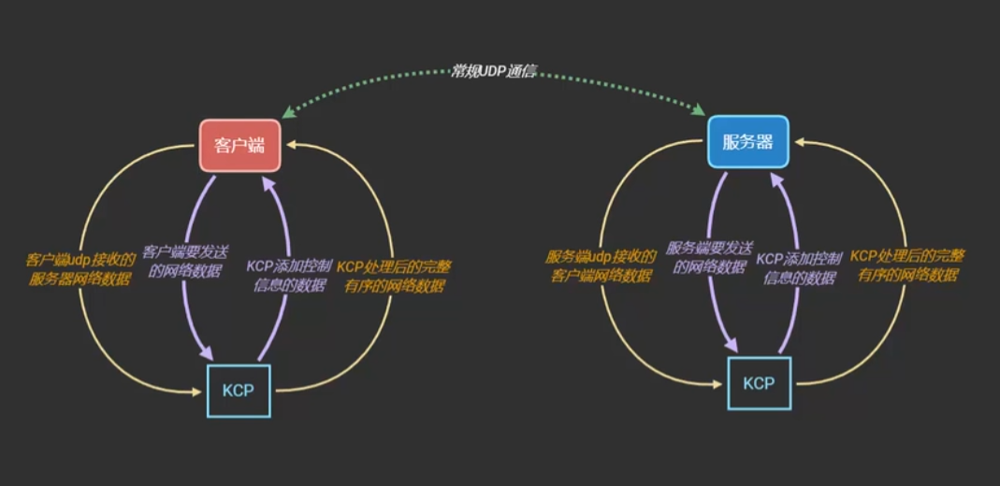

# KCP技术原理

## KCP是什么

开源地址： [https://github.com/skywind3000/kcp/tree/master](https://github.com/skywind3000/kcp/tree/master)

KCP是一个快速可靠协议，能以比 TCP浪费10%-20%的带宽的代价，换取平均延迟降低 30%-40%，且最大延迟降低三倍的传输效果。纯算法实现，并不负责底层协议（如UDP）的收发，需要使用者自己定义下层数据包的发送方式，并以 callback的方式提供给 KCP。

这里翻译一下，供参考

1. KCP是一个ARQ协议：Automatic Repeat Query/Automatic repeat request，自动消息重发机制。
2. 可靠协议，解决了丢包、乱序等问题。
3. 可实现可靠UDP传输。不负责底层协议的收发，但是可以应用在几乎任何底层协议上，比如UDP。
4. 比TCP快速，延迟低。

## 实现原理

网络模块是非常重要基础模块，了解实现原理和实现细节非常重要。这关系到后续出现问题能否解决，根据项目情况进一步定制，甚至技术选型是否能通过等重要问题。

KCP实现了一整套与TCP类似/功能对应的机制，它们有：

- 超时重传
- 快速重传
- 滑动窗口
- 流量控制
- 拥塞控制

### 那我们为什么不直接用TCP呢？或者说它为什么比TCP快？

用作者的话说：TCP是为流量设计的（每秒内可以传输多少KB的数据），讲究的是充分利用带宽。而KCP是为流速设计的（单个数据包从一端发送到一端需要多少时间），以10%-20%带宽浪费的代价换取了比 TCP快30%-40%的传输速度。

因为TCP在传输层，用户程序不能进行更多的定制，基于UDP的KCP就可以通过调节与TCP类似的机制中的一些设定，实现了下面的技术特性，达到了提高流速的效果。

- **RTO翻倍vs不翻倍**：TCP超时计算是RTOx2，这样连续丢三次包就变成RTOx8了，十分恐怖，而KCP启动快速模式后不x2，只是x1.5（实验证明1.5这个值相对比较好），提高了传输速度。
- **选择性重传 vs 全部重传**：TCP丢包时会全部重传从丢的那个包开始以后的数据，KCP是选择性重传，只重传真正丢失的数据包。
- **快速重传**：发送端发送了1,2,3,4,5几个包，然后收到远端的ACK: 1, 3, 4, 5，当收到ACK3时，KCP知道2被跳过1次，收到ACK4时，知道2被跳过了2次，此时可以认为2号丢失，不用等超时，直接重传2号包，大大改善了丢包时的传输速度。
- **延迟ACK vs 非延迟ACK** ：TCP为了充分利用带宽，延迟发送ACK（NODELAY都没用），这样超时计算会算出较大RTT时间，延长了丢包时的判断过程。KCP的ACK是否延迟发送可以调节。
- **UNA vs ACK+UNA** ：ARQ模型响应有两种，UNA（此编号前所有包已收到，如TCP）和ACK（该编号包已收到），光用 UNA会导致丢包时全部重传，光用 ACK又会导致 ACK丢失成本太高。KCP有单独ACK，且数据包和ACK包都带UNA信息，有效降低ACK丢失成本。
- **非退让流控**：KCP正常模式同TCP一样使用公平退让法则，即发送窗口大小由：发送缓存大小、接收端剩余接收缓存大小、丢包退让及慢启动这四要素决定。但传送及时性要求很高的小数据时，可选择通过配置跳过后两步，仅用前两项来控制发送频率。以牺牲部分公平性及带宽利用率之代价，换取了开着BT都能流畅传输的效果。

### 使用原理

以一个消息的收发为例：

1. 使用socket接口搭建udp底层通信，例如C#的Socket API。
2. 发送数据前，调用kcp的send接口，发送到kcp，进行数据包拆分、封装。
3. 设置kcp的output回调接口，数据包处理完成后，自动回调output接口。在这里通过socket发送到服务器
4. 服务器部分运行流程与客户端相同，这里略过。消息处理完成后，服务器发包到客户端。
5. 客户端的socket接口收到数据，调用kcp的input接口，kcp对数据包进行合并、解包。再通过回调接口，把真实的数据包返回给客户端进行逻辑处理。

接下来，结合大量现成的TCP资料的机制原理，一一讲解KCP这些技术特性。