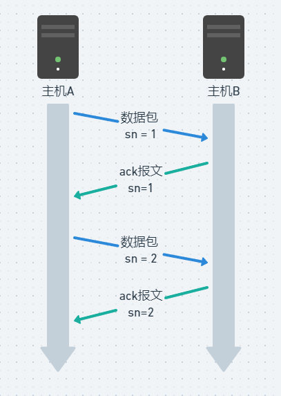

# KCP解读：基础消息收发

接下来会涉及源码解读，这里以C#版本为基础讲解。

> kcp已经被port到很多语言和平台，它们都是C语言版本的移植，正常来说为了移植容易，保持一致性。方法、变量命名是一样的，区别不大。
> 

## Segment

应用层发送的数据可能是一段文本、编码格式如protobuf、音频、视频，本质上它们都是二进制数据(一般是bytes数组)，我们叫它**原始数据**。

原始数据输入给kcp后，kcp对数据进行封装：增加消息头；超长数据进行分段等，封装后的数据叫做**Segment**。有一些不同的叫法，数据段、数据包、网络包等等，为了防止歧义，以下统一叫做**数据包或简称包**。数据包有包头和包体，包体就是原始数据。

### 包头

```csharp
|<------------ 4 bytes ------------>|
+--------+--------+--------+--------+
|               conv                | conv：Conversation, 会话序号，用于标识收发数据包是否一致
+--------+--------+--------+--------+ cmd: command，用于标识指令，例如：push，ack等
|  cmd   |  frg   |       wnd       | frg: Fragment, 分段序号，序号从大到小
+--------+--------+--------+--------+ wnd: 接收窗口大小
|                ts                 | ts: 发送的时间戳
+--------+--------+--------+--------+
|                sn                 | sn: Segment序号
+--------+--------+--------+--------+
|                una                | una: Unacknowledged, 当前未收到的序号，即代表这个序号之前的包均收到
+--------+--------+--------+--------+      
|                len                | len: data数据的长度
+--------+--------+--------+--------+
```

这里先了解每个字段的含义，后续结合源码加深理解。

## TCP的确认应答机制

推荐小林coding这个系列 [https://xiaolincoding.com/network/3_tcp/tcp_feature.html#重传机制](https://xiaolincoding.com/network/3_tcp/tcp_feature.html#%E9%87%8D%E4%BC%A0%E6%9C%BA%E5%88%B6)

TCP 实现可靠传输的方式之一，是通过序列号与确认应答。

在 TCP 中，当发送端的数据到达接收主机时，接收端主机会返回一个确认应答消息，表示已收到消息。



但在错综复杂的网络，并不一定能如上图那么顺利能正常的数据传输，万一数据在传输过程中丢失了呢？

所以 TCP 针对数据包丢失的情况，会用**重传机制**解决。

### **超时重传**

重传机制的其中一个方式，就是在发送数据时，设定一个定时器，当超过指定的时间后，没有收到对方的 `ACK` 确认应答报文，就会重发该数据，也就是我们常说的**超时重传**。

TCP 会在以下两种情况发生超时重传：

- 数据包丢失
- 确认应答丢失

> 超时时间应该设置为多少呢？
> 

我们先来了解一下什么是 `RTT`（Round-Trip Time 往返时延），从下图我们就可以知道：


`RTT` 指的是**数据发送时刻到接收到确认的时刻的差值**，也就是包的往返时间。

超时重传时间是以 `RTO` （Retransmission Timeout 超时重传时间）表示。

假设在重传的情况下，超时时间 `RTO` 「较长或较短」时，会发生什么事情呢？


上图中有两种超时时间不同的情况：

- 当超时时间 **RTO 较大**时，重发就慢，丢了老半天才重发，没有效率，性能差；
- 当超时时间 **RTO 较小**时，会导致可能并没有丢就重发，于是重发的就快，会增加网络拥塞，导致更多的超时，更多的超时导致更多的重发。

精确的测量超时时间 `RTO` 的值是非常重要的，这可让我们的重传机制更高效。

根据上述的两种情况，我们可以得知，**超时重传时间 RTO 的值应该略大于报文往返 RTT 的值**。


至此，可能大家觉得超时重传时间 `RTO` 的值计算，也不是很复杂嘛。

好像就是在发送端发包时记下 `t0` ，然后接收端再把这个 `ack` 回来时再记一个 `t1`，于是 `RTT = t1 – t0`。没那么简单，**这只是一个采样，不能代表普遍情况**。

实际上「报文往返 RTT 的值」是经常变化的，因为我们的网络也是时常变化的。也就因为「报文往返 RTT 的值」 是经常波动变化的，所以「超时重传时间 RTO 的值」应该是一个**动态变化的值**。

## KCP消息发送

原始数据发送到kcp的`send`接口，kcp根据mss(最大报文长度)拆分成多个数据包，加入到消息发送队列`snd_queue`

### flush方法

消息发送逻辑都在这个方法里。

首先，将消息发送队列的包进行初始化，放置到发送缓冲区：

```csharp
if (snd_queue.TryDequeue(out var newseg))
{
    newseg.conv = conv;//频道号
    newseg.cmd = IKCP_CMD_PUSH;//报文类型：数据报文
    newseg.wnd = wnd_;//窗口大小
    newseg.ts = current_;//发送时间戳
    newseg.sn = snd_nxt;//发送编号
    snd_nxt++;//自增
    newseg.una = rcv_nxt;//
    newseg.resendts = current_;//重传的时间戳。超过当前时间重发这个包，发送时会继续修改，加rto
    newseg.rto = rx_rto;//超时重传时间
    newseg.fastack = 0;//快速重传技术，每次发送都置零
    newseg.xmit = 0;//重传次数
    lock (snd_bufLock)
    {
        snd_buf.AddLast(newseg);//加入到正在发送列表
    }
}
```

snd_nxt是发送编号，值是下一个要发的数据包编号。una表示这个编号之前的包，接收端都收到了。xmit是重传次数，=0直接发送。

```csharp
if (segment.xmit == 0) //首次发送
{
    //新加入 snd_buf 中, 从未发送过的报文直接发送出去;
    needsend = true;
    segment.xmit++;
    segment.rto = rx_rto;
    segment.resendts = current_ + rx_rto + rtomin;
}
```

resendts是超时时间戳，后面用于检查重发。最后，调用kcp回调`callbackHandle.Output` 给应用层进行数据发送，该回调中实现消息的发送即可。

## 消息接收

应用层收到网络数据后，发送到kcp的`Input` 接口，在这里进行数据包解析。

假设接收到刚才发送过来的数据包：

1. 先解析包头，检查cmd字段发现是数据报文，进行数据报文的处理流程。
2. *`ikcp_ack_push`* 将sn放入ack列表，稍后回复ACK报文给发送端，告知sn这个包已经收到。
3. `Parse_data` 解析数据包，根据sn从小到大排序把数据包放入接收缓冲列表`rcv_buf` 。
4. `Move_Rcv_buf_2_Rcv_queue` 遍历`rcv_buf` ，如果sn==`rcv_nxt` 待接收编号，那么把数据包放入待处理消息列表`rcv_queue`
5. 此时，`rcv_queue` 就是按顺序接收到的数据包列表，在kcp的`ikcp_recv` 类似的消息接收接口中，遍历该列表，重组得到原始数据。应用层调用该接口后，得到原始数据内容。

### ACK

ackowledged收到数据包的确认报文，接收方收到数据类型的报文后。在上面第2步，sn加入到ack列表，然后发送ack报文给发送方，ack包的sn赋值为该sn。

接收方收到ack报文后，更新`rtt`的值，通过`Parse_ack` 在`snd_buf`中删除sn这一条，至此一个消息就完整的发送完毕了。

## 超时重发

在flush方法中，遍历消息发送缓存列表，如下条件的数据包进行重发。

```csharp
else if (Itimediff(current_, segment.resendts) >= 0)//超时重发
{
      //发送过的, 但是在 RTO 内未收到 ACK 的报文, 需要重传;
      needsend = true;
      segment.xmit++;
```