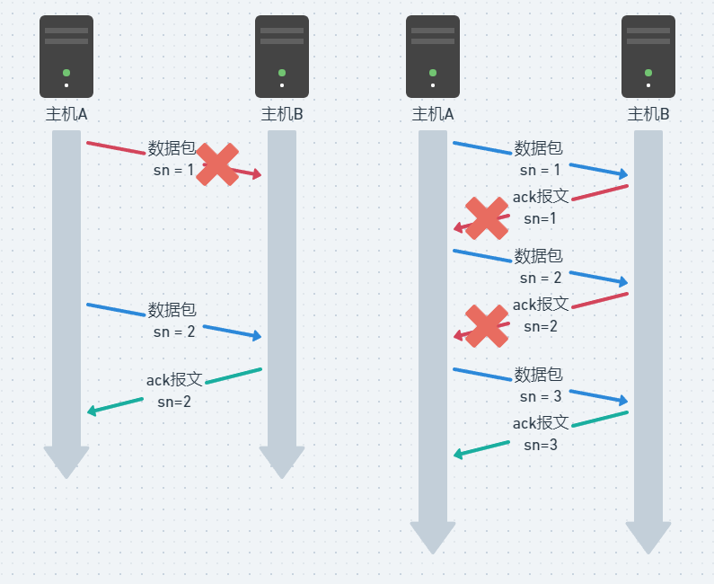
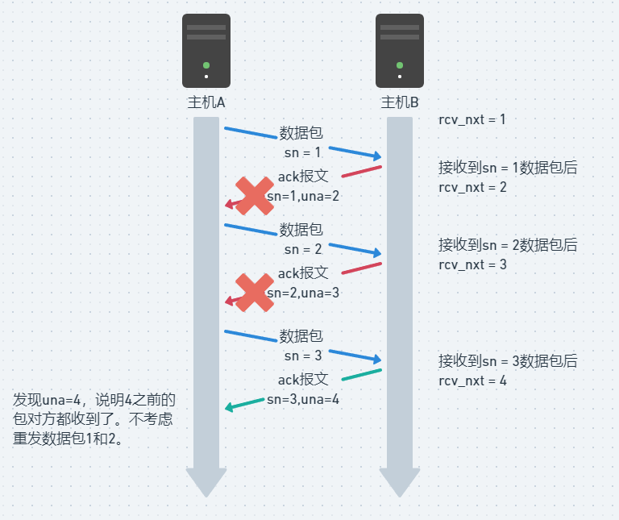

# KCP解读：重传机制

关于TCP的机制可参考：[https://xiaolincoding.com/network/3_tcp/tcp_feature.html#sack-方法](https://xiaolincoding.com/network/3_tcp/tcp_feature.html#sack-%E6%96%B9%E6%B3%95)

这里按照KCP的实现进行介绍，被发送方认为丢包有两种情况：

1. 数据包本身丢失
2. ack报文丢失

第一种情况下，数据包丢失，进行重传即可。第二种情况有所不同，主机B收到了所有数据包，但是ack报文丢包了，这两个包是不需要重发的，kcp通过ack+una的方式解决该问题。

## ACK+UNA 选择性重传

kcp在包头中，增加了`una`字段（unacknowledged），意思是接收方正在等待接收的数据包编号。如图：

接收方持有一个变量`rcv_nxt` ，是正在等待接收的数据包编号。当这个等待中的编号数据包收到，进行自增。把它发给对方后，对方就知道接收方实际收到的包了，那么中间ack报文丢失也不会有影响。

kcp就是通过ack和una两个数据，有效降低了丢包重发的数量。

### 源码

包头的初始化代码：

`newseg.una = rcv_nxt;`

Input中收到数据包，对una的处理：

`Parse_una(una);*//删除una之前的segment，una = rcv_nxt表示，对方una - 1已经收到，不用留着考虑重发了。*`

## 快速重传

TCP 还有另外一种**快速重传（Fast Retransmit）机制**，它**不以时间为驱动，而是以数据驱动重传**。

快速重传机制，是如何工作的呢？其实很简单，一图胜千言。

在上图，发送方发出了 1，2，3，4，5 份数据：

- 第一份 Seq1 先送到了，于是就 Ack 回 2；
- 结果 Seq2 因为某些原因没收到，Seq3 到达了，于是还是 Ack 回 2；
- 后面的 Seq4 和 Seq5 都到了，但还是 Ack 回 2，因为 Seq2 还是没有收到；
- **发送端收到了三个 Ack = 2 的确认，知道了 Seq2 还没有收到，就会在定时器过期之前，重传丢失的 Seq2。**
- 最后，收到了 Seq2，此时因为 Seq3，Seq4，Seq5 都收到了，于是 Ack 回 6 。

所以，快速重传的工作方式是当收到三个相同的 ACK 报文时，会在定时器过期之前，重传丢失的报文段。

### 源码

flush中判断fastack是否超过限制

`else if (segment.fastack >= resent)`

Input中收到ack报文，记录本次的maxack，并在`Parse_fastack` 中对比发送缓冲区对fastack进行自增

`maxack = sn;`

`Parse_fastack`