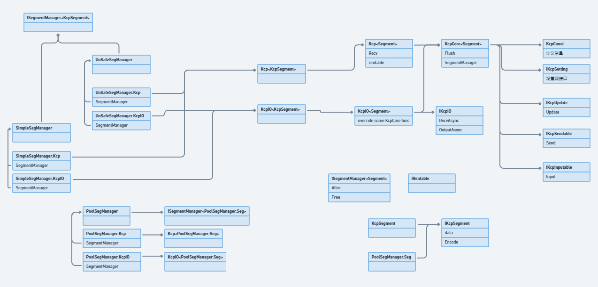

# KCP解读：C#库类图

作者做了很多接口、扩展的设计，核心逻辑定义在KcpCore部分，其他一些类可以进行重新、扩展。

## 参考

[https://juejin.cn/post/6844904030305681415](https://juejin.cn/post/6844904030305681415)

[https://juejin.cn/post/6995208522153590820](https://juejin.cn/post/6995208522153590820)

[https://juejin.cn/post/7134888107907743774](https://juejin.cn/post/7134888107907743774)

[https://github.com/Uyouii/Redundancy-Transmission-Protocol/blob/master/Note/KCP 源码解析.md](https://github.com/Uyouii/Redundancy-Transmission-Protocol/blob/master/Note/KCP%20%E6%BA%90%E7%A0%81%E8%A7%A3%E6%9E%90.md)

[https://github.com/skywind3000/kcp/tree/master](https://github.com/skywind3000/kcp/tree/master)

[https://github.com/l42111996/java-Kcp](https://github.com/l42111996/java-Kcp)

[https://github.com/KumoKyaku/KCP](https://github.com/KumoKyaku/KCP)