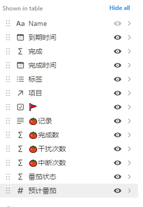
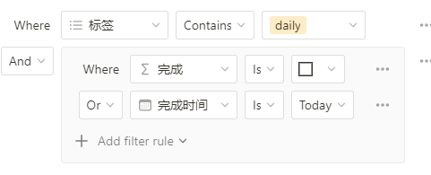

# Notion中应用番茄工作法

经过对番茄工作法的系统学习后，对原来在notion进行的工作流进行改造，创建番茄工作法工作主页，支持了作者所有的方法要点：

- 日程安排和计划
- 番茄时钟；番茄部分和休息部分；
- 番茄预计、完成数量记录
- 记录干扰和中断，与书中的标记法相同，创建干扰任务
- 番茄完成数量、干扰、中断的统计

效果如题图，搭建方法在这里分享出来供参考。

## 番茄时钟

使用`/Embed` ，嵌套[`https://pomofocus.io/app`](https://pomofocus.io/app) 即可，这是一个非常好用的在线工具。可以设置番茄时间，小休息时间，大休息时间，番茄统计等等。

<aside>
💡 这个嵌入不能不能记录cookie，导致网页刷新以后，刚才开始的番茄就没了。开始以后不要切网页

</aside>

## Database

创建一个database，名称叫做Tasks，包含如下属性：

- Name：任务名称，类型Text
- 完成时间：类型日期，可以用来筛选回顾某一时间段完成的任务。
- 完成：类型公式，根据完成日期标注是否完成。`larger(timestamp(prop("完成时间")), 0)`
- 标签：类型多选，用于筛选
- 项目：可选项；我这里比较复杂，是嵌套另外一张database的item；逻辑是，有些任务包含很多子任务，比如学习微积分，包含极大极小、求极限、积分、微分、微积分、指数等等内容。学习微积分就是一个项目，里面的小任务是拆分后的工作项。
- 番茄记录：类型Text，记录格式为：`x`表示完成一个番茄；``` 表示发生干扰；`-` 表示番茄中断，例如`x```x-xx` 表示完成4次番茄，3次干扰，1次中断。这是与作者书中的记录方式是对应的。
- 完成数：类型公式，`length(replaceAll(replaceAll(prop("🍅记录"), "`", ""), "-", ""))`
- 干扰次数：类型公式，`length(replaceAll(replaceAll(prop("🍅记录"), "x", ""), "-", ""))`
- 中断次数：类型公式，`length(replaceAll(replaceAll(prop("🍅记录"), "`", ""), "x", ""))`
- 番茄状态：类型公式，用emoji的方式表示番茄记录，美观一些，`replaceAll(replaceAll(replaceAll(prop("🍅记录"), "x", "🍅"), "-", "⛔"), "`", "📩")`
- 预计番茄：数字，预估番茄数量
- 可选：小红旗 优先任务；到期时间 到期前必须处理的任务；



## DatabseView

日程部分：使用`/Linked view of database` 制作database的视图，选择关联Tasks Database，制作如下几个View：

- 日程：创建filter，筛选标签中包含daily；并且还未完成或者完成时间是今天的。这样就能看到今天计划内的任务和今天完成的任务了。



- Inbox：表示任务收件箱，所有的突发奇想，计划任务，长期任务等等，都在这里。filter选项，选择完成状态未勾选即可。

干扰任务部分：使用`/Linked view of database` 制作database的视图，选择关联Tasks Database，制作View，创建filter筛选未完成的，And 标签中包含`interupt` 的任务。

### 工作方法

1. 日常工作生活中，创新新任务，它们会被筛选到Inbox View当中。
2. 开始计划今天的日程，从Inbox中挑选今天要做的任务，点击标签字段，增加`daily` 标签。这些任务就被筛选到日程View了。
3. 开始番茄，切换到日程View，在番茄记录字段按照格式进行填写，然后会自动更新番茄的统计。任务完成，选择完成时间确认时间，任务就标记为完成状态。
4. 出现干扰，在干扰任务View创新新任务，任务会自带`interupt` 标记。然后决定如何处理干扰任务。

注意每天工作结束对日程表进行回顾，总结今天的情况。坚持就有以外收获，战胜拖延。