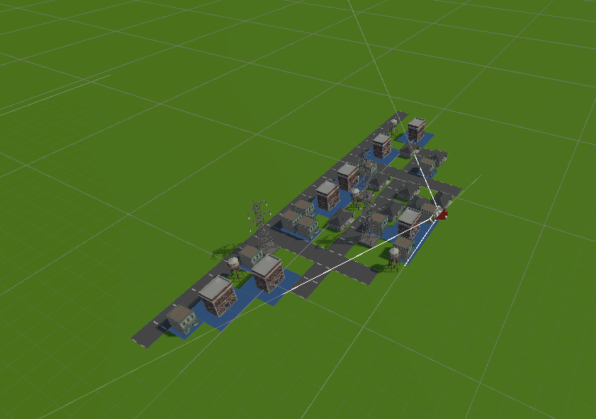

# UnityAPI：利器CullingGroup

[https://docs.unity3d.com/Manual/CullingGroupAPI.html](https://docs.unity3d.com/Manual/CullingGroupAPI.html)

这个API非常强大，可以快速的实现自定义的Occlusion culling和Lod系统，并且性能表现极佳。

## 简要原理

CullingGroup为了性能考虑，把所有的物体模拟为球形，传入摄像机后，检测球形与相机视窗的交集，通过onStateChanged通知应用层物体的可见性变化，在这里进行显示隐藏控制即可。

## 代码注释

```csharp
CullingGroup group = new CullingGroup();
group.targetCamera = Camera.main;
BoundingSphere[] spheres = new BoundingSphere[1000];
// 把游戏中的物体与Sphere一一对应，并告知cullingGroup数量变化。
spheres[0] = new BoundingSphere(Vector3.zero, 1f);
group.SetBoundingSpheres(spheres);
group.SetBoundingSphereCount(1);

group.onStateChanged = StateChangedMethod;

// Sphere状态发生变化后，这里就会得到通知
private void StateChangedMethod(CullingGroupEvent evt)
{
    if(evt.hasBecomeVisible)
        Debug.LogFormat("Sphere {0} has become visible!", evt.index);
    if(evt.hasBecomeInvisible)
        Debug.LogFormat("Sphere {0} has become invisible!", evt.index);
}
```

## 效果展示

